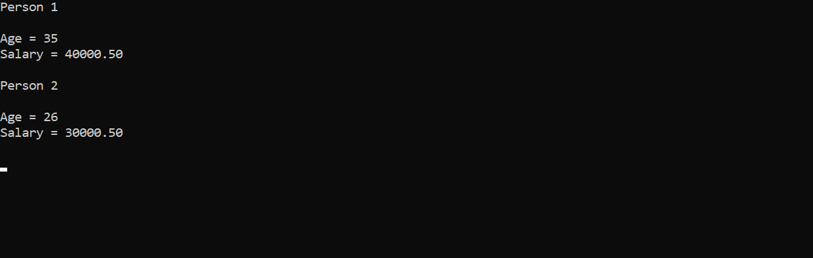
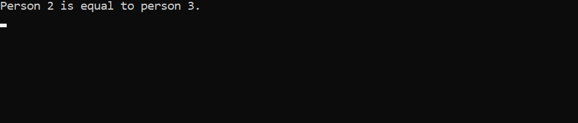

<!--comment line-->
_S_~~tru~~__c__`ture`  
---

<p> It's a programme of c contain structure related things.</p>

- [x] Initial
- [x] 
- [x]

<ol>
<li>starting</li>
<li>about</li>
</ol>

### initial

```c
#include<stdio.h>
struct person
{
    int age;
    float salary;
};
int main()
{
    struct person person1,person2;

    person1.age=50;
    person1.salary=80,000.50;

    printf("Person 1\n");
    printf("Age = %d\n",person1.age);
    printf("Salary = %.2f\n\n",person1.salary);

    person2.age=46;
    person2.salary=60,000.50;

    printf("Person 2\n");
    printf("Age = %d\n",person2.age);
    printf("Salary = %.2f\n",person2.salary);

    getch();

}
```  
---
<image src="./images/initial.png" width="500" title="initial"/>  

### Local && Global

- [x] Defferent Declaration
- [x] outside 

<p style="text-align:center; color :lightblue;">Inside main function of struct is local and outside can be use in other called global.</p> 

## Local
```c
#include<stdio.h>
int main()
{
    struct person
    {
        int age;
        float salary;
    };
    struct person person1,person2;

    person1.age=40;
    person1.salary=20000.60;

    printf("Person 1\n\n");
    printf("Age = %d\n",person1.age);
    printf("Salary = %.2f\n\n",person1.salary);

    person2.age=30;
    person2.salary=25000.50;

    printf("Person 2\n\n");
    printf("Age = %d\n",person2.age);
    printf("Salary = %.2f\n\n",person2.salary);

    getch();
}
```

<image src="./images/local.png" width="500" title="Local"/>

## Glaobal

```c
#include<stdio.h>
struct person
{
    int age;
    float salary;
};
struct person person1,person2;
int main()
{
    person1.age=35;
    person1.salary=40000.50;

    printf("Person 1\n\n");
    printf("Age = %d\n",person.age);
    printf("Salary = %.2f\n\n",person.salary);

    person2.age=26;
    person2.salary= 30000.50;

    printf("Person 2 \n\n");
    printf("Age = %d\n",person.age);
    printf("Salary = %.2f\n\n",person.salary);

    getch();
}
```


### Input information

```c
#include<stdio.h>
    struct person
    {
        int age;
        float salary;
    };
    struct person person1,person2;
int main()
{
    printf("Enter Person 1 Age : ");
    scanf("%d",&person1.age);

    printf("Enter Person 1 Salary : ");
    scanf("%f",&person1.salary);

    printf("Person 1\n\n");
    printf("Age = %d\n",person1.age);
    printf("Salary = %.2f\n\n",person1.salary);

    printf("Enter Person 2 Age : ");
    scanf("%d",&person2.age);
    printf("Enter Person 2 Salary : ");
    scanf("%f",&person2.salary);

    printf("Person 2\n\n");
    printf("Age = %d\n",person2.age);
    printf("Salary = %.2f\n\n",person2.salary);

    getch();
}
```  
<image src="./images/inputinformation.png" width="400" title="input-information"/>  

### practice

- [x] Directly initialised
- [x] Transfer one element to another

```c
#include<stdio.h>
struct person
{
    int age;
    float salary;
};
int main()
{
    struct person person1={20,35000.50};
    struct person person2,person3;

    person2.age=30;
    person2.salary=40000.40;

    person3=person2;

    printf("Person 1\n\n");
    printf("Age = %d\n",person1.age);
    printf("Salary = %.2f\n\n",person1.salary);

    printf("Person 2\n\n");
    printf("Age = %d\n",person2.age);
    printf("Salary = %.2f\n\n",person2.salary);

    printf("Person 3\n\n");
    printf("Age = %d\n",person3.age);
    printf("Salary = %.2f\n\n",person3.salary);

    getch();
}
```  
<image src="./images/diff.png" width="500" title="different-angle"/>  

### compare

```c
#include<stdio.h>
struct person
{
    int age;
    float salary;
};
int main()
{
    struct person person1={20,40000.50};
    struct person person2,person3;

    person2.age=30;
    person2.salary=40000.60;

    person3=person2;

    if(person1.age==person2.age && person1.salary==person2.salary)
    {
        printf("Person 1 is equal to person 2.\n");
    }
    else
    printf("Person 1 is not equal to person 2.\n");

    getch();
}
```
<image src="./images/notequal.png" width="500" title="not equal"/>  

```c
#include<stdio.h>
struct person
{
    int age;
    float salary;
};
int main()
{
    struct person person1={20,40000.50};
    struct person person2,person3;

    person2.age=30;
    person2.salary=40000.60;

    person3=person2;

    if(person2.age==person3.age && person2.salary==person3.salary)
    {
        printf("Person 2 is equal to person 3.\n");
    }
    else
    printf("Person 2 is not equal to person 3.\n");

    getch();
}
```  
  
</br>

### Structure with Array

```c
// write a programme that print structure using array
#include<stdio.h>
struct Person
{
    int age;
    float salary;
};
int main()
{
    struct Person Person[4];

    for(int i=0; i<4; i++)
    {
        printf("Enter the information of Person %d\n\n",i+1);
        printf("Enter Age = ");
        scanf("%d",&Person[i].age);
        printf("Enter Salary = ");
        scanf("%f",&Person[i].salary);
    }

    printf("\n\n");

    for(int j=0; j<4; j++)
    {
        printf("Person %d\n\n",j+1);
        printf("Age = %d\n",Person[j].age);
        printf("Salary = %.2f\n\n",Person[j].salary);
    }
    getch();
}
```  
<image src="./images/structurewitharray.png" width="500" title="structurewitharray"/>

### array & string

```c
#include<stdio.h>
struct person
{
    char name[50];
    int age;
    float salary;
};
int main()
{
    struct person person[3];
    for(int i=0; i<3; i++)
    {
        printf("Enter the information of person %d\n\n",i+1);
        printf("Name : ");
        fflush(stdin);
        gets(person[i].name);
        printf("Age : ");
        scanf("%d",&person[i].age);
        printf("Salary : ");
        scanf("%f",&person[i].salary);
        printf("\n");
    }
    printf("\n\n");
    for(int j=0; j<3; j++)
    {
        printf("Person %d\n\n",j+1);
        printf("Name : %s\n",person[j].name);
        printf("Age : %d\n",person[j].age);
        printf("Salary : %.2f\n\n",person[j].salary);
    }
    getch();
}
```  
<image src="./images/stringarray.png" width="400" title="stringarray"/>  

### function with structure

```c
#include<stdio.h>
struct person
{
    char name[40];
    int age;
    float salary;
};
void display(struct person p[])
{
    for(int i=0; i<3; i++)
    {
        printf("Person %d\n\n",i+1);
        printf("Name : %s\n",p[i].name);
        printf("Age : %d\n",p[i].age);
        printf("Salary : %.2f\n\n",p[i].salary);
    }
}
int main()
{
    struct person person[3];
    for(int i=0; i<3; i++)
    {
        printf("Enter the information for person %d\n\n",i+1);
        printf("Name : ");
        fflush(stdin);
        gets(person[i].name);
        printf("Age : ");
        scanf("%d",&person[i].age);
        printf("Salary : ");
        scanf("%f",&person[i].salary);

        printf("\n\n");
        
    }
    display(person);
}
```  
<image src="./images/functionstructure.png" width="500" title="function-structure"/>  

### union

```c
#include<stdio.h>
union test
{
    int age,salary;
};
int main()
{
    union test t;

    t.age=30;
    printf("t.age = %d\n",t.age);
    printf("t.salary = %d\n\n",t.salary);

    t.salary= 5000;
    printf("t.age = %d\n",t.age);
    printf("t.salary = %d\n",t.salary);
}
```  
<image src="./images/union.png" width="400" title="union"/>  

### size of union & structure

```c
#include<stdio.h>
union test1
{
    int a,b;
};
union test2
{
    int age;
    char name;
};
union test3
{
    char world;
    double salary;
};
struct test4
{
    int num;
    float data;
    double salary;
    char name;
};
int main()
{
    union test1 test11;
    union test2 test22;
    union test3 test33;
    struct test4 test44;
    test11.a=1;
    test11.b=3;
    test22.age=55;
    test22.name="rasel";
    test33.salary=40000;
    test33.world="world";
    test44.data=44.4;
    test44.name="anis";
    test44.num=40;
    test44.salary=50000.40;

    printf("Union Test 1 : %d\n",sizeof(test11.a));
    printf("Union Test 1 : %d\n",sizeof(test11.b));
    printf("Union Test 2 : %d\n",sizeof(test22.age));
    printf("Union Test 2 : %d\n",sizeof(test22.name));
    printf("Union Test 3 : %d\n",sizeof(test33.world));
    printf("Union Test 3 : %d\n",sizeof(test33.salary));
    printf("Union Test 4 : %d\n",sizeof(test44.num));
    printf("Union Test 4 : %d\n",sizeof(test44.data));
    printf("Union Test 4 : %d\n",sizeof(test44.salary));
    printf("Union Test 4 : %d\n",sizeof(test44.name));

    printf("\n\nValue\n\n");

    printf("Union Test 1 : %d\n",test11.a);
    printf("Union Test 1 : %d\n",test11.b);
    printf("Union Test 2 : %d\n",test22.age);
    printf("Union Test 2 : %d\n",test22.name);
    printf("Union Test 3 : %d\n",test33.world);
    printf("Union Test 3 : %d\n",test33.salary);
    printf("Union Test 4 : %d\n",test44.num);
    printf("Union Test 4 : %d\n",test44.data);
    printf("Union Test 4 : %d\n",test44.salary);
    printf("Union Test 4 : %d\n",test44.name);

    getch();
}
```

<image src="./images/sizevalue.png" width="500" title="sizevalue"/>  

<p style="text-align:left; color:purple;">size is not changing but the value of union is changed to the highest value.all the union values are high value equal but structure is not same . all the equal of value is called structrue</p>
